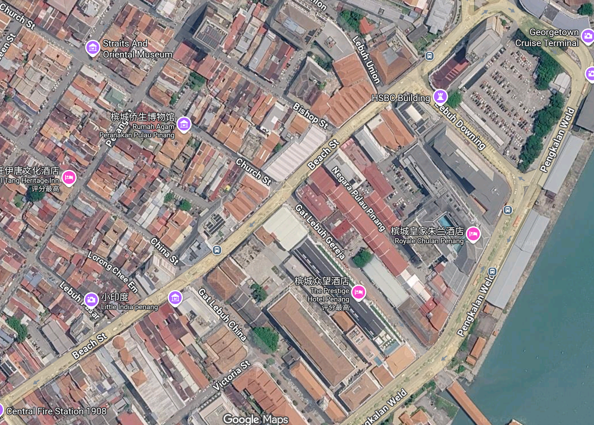

# CIV5802 Case Study 2：J19–J20 双路口仿真

**中文** | [English](README_EN.md)

基于马来西亚槟城两个相邻路口的 SUMO 课程项目，记录建模、方向修正和配时比较过程，供后续同学学习及教师参考。**车辆靠左行驶（left-hand traffic）**，车道连接、转向和信号设置均需据此核对。

> 当前为私有备份，尚非最终教学版。四套现存输出均不完整，需重新运行后才能用于正式分析。

*作者提供的 Google Maps 截图，仅作区域参考，不替代交通调查资料；保留原图标识。公开发布前需核对地图素材的使用与署名要求。*

## 作业要求

根据教师说明及作者线下确认：选取两个路口，利用给定资料建立 SUMO 模型，运行并提取结果，识别各路口和整个路网的关键交通流向，并提出有数据支撑的减延误建议。

教师不强制要求重新仿真改善方案；本项目额外设置 AM/PM 基线与候选配时共四套场景。此处仅为本次作业摘要，后续课程以当期教师要求为准。

交通调查资料来自 ADB 公开发布的 [*Penang Smart Mobility Micro-Simulation Model Development: Final Report*](https://events.development.asia/materials/20240408/penang-smart-mobility-micro-simulation-model-development-final-report)。本仓库不收录或转发课程版 PDF；请从官方页面获取完整报告并遵守其版权及署名要求。

## 项目过程

自行建立 baseline → 整理 AM/PM 需求 → 修正 J46→J20 错误方向（仅保留 J20→J46）→ 手动验证最小模型 → 扩展为四套场景 → 备份至 GitHub。

详见[项目记录](sandbox03/J19_J20_project_record.txt)。历史汇总不能证明当前 XML 仍然完整；短时间的 SUMO-GUI 运行可能覆盖同名输出。

## 文件与运行

工程位于 [sandbox03/SUMO_case_study_2_MIAO](sandbox03/SUMO_case_study_2_MIAO/)：

| 场景文件夹 | 用途 |
| --- | --- |
| J19_J20_AM_baseline | AM 基线 |
| J19_J20_PM_baseline | PM 基线 |
| J19_J20_AM_signal_optimization | AM 候选配时 |
| J19_J20_PM_signal_optimization | 同一候选配时在 PM 下的测试 |

请先复制场景目录，再用 SUMO-GUI 打开其中同名 `.sumocfg`。历史使用版本为 SUMO 1.27.1；运行会覆盖 `outputs/` 中同名文件，必须先备份。PM 候选方案并不是针对 PM 单独求得的最优方案。

完整备份：[2026-09-04 快照](sandbox03_snapshot_2026-09-04.zip)。课程版 PDF、最终报告及完整后处理脚本不在本仓库中。

## 读取结果前注意

- **时间：**需求为 0–3600 s，仿真为 0–4200 s；最后 600 s 是排空期，不是预热期。历史队列均值包含排空期，改变时间窗口后必须重新计算。
- **需求：**当前以默认乘用车进行 PCU 等效简化，不代表真实混合车型；部分跨路口流量来自转向比例拆分，仍需补充原始页码与计算依据。
- **指标：**`timeLoss`、`waitingTime` 和 `departDelay` 不可混用；整条 route 的延误不能直接视为单一路口转向延误。因插入延迟，原定需求车辆可能在 3600 s 后才进入路网。
- **当前输出：**2026-09-04 检查时，AM 基线没有有效队列时间步；AM 候选、PM 基线和 PM 候选分别只记录至 345、314 和 565 s，不能支持完整仿真结论。

字段定义参见 SUMO 官方 [TripInfo](https://sumo.dlr.de/docs/Simulation/Output/TripInfo.html) 与 [QueueOutput](https://sumo.dlr.de/docs/Simulation/Output/QueueOutput.html)。

## 公开前待办

重新运行并保存完整输出；统一统计口径；补充数据追溯和可复现的后处理；清理无效文件及个人信息；确认地图及其他第三方材料的公开权限与许可证。完成后由作者检查并手动公开仓库。

## 免责声明

本整合包以本人自行制作的 baseline 为基础，经 AI 辅助整理、总结和整合，无偿分享供个人学习交流。它不是学校、教师或 SUMO 官方资料，不保证模型或结果准确完整。使用者应自行核验，遵守学术诚信要求，不得直接用于实际交通信号部署。无偿分享不改变第三方材料的权利归属，复用范围以相关授权及最终许可证为准。
